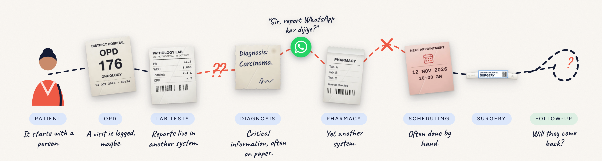
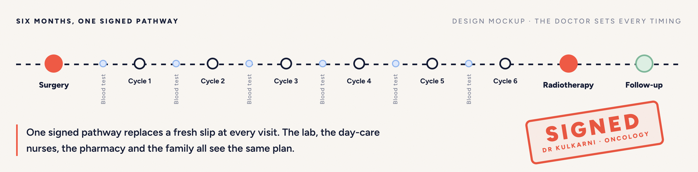
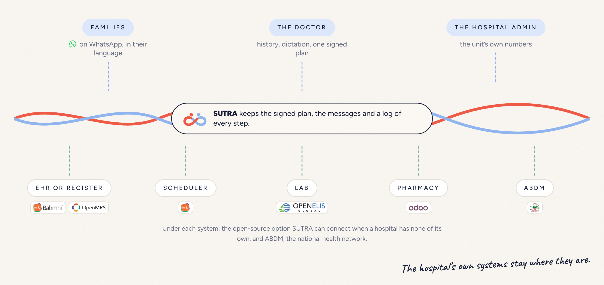
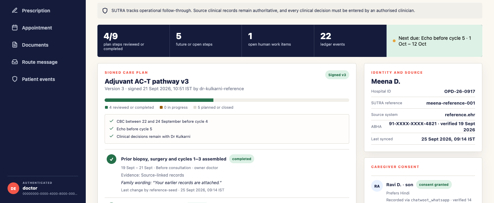
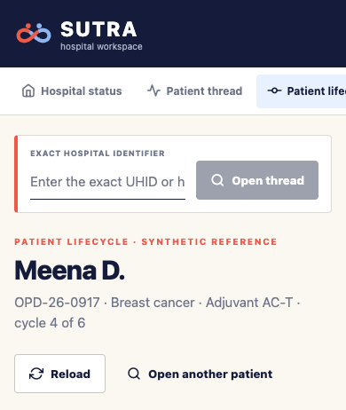

<p align="center">
  
</p>

<p align="center">
  <b>SUTRA follows a doctor's signed cancer-care plan through the systems an Indian hospital already has, so that no planned step is missed.</b>
</p>

<p align="center">
  <a href="./LICENSE"></a>
  <a href="./go.mod"></a>
  <a href="./apps/web"></a>
  
  <a href="https://sutrahealth.org"></a>
</p>

<p align="center">
  <a href="https://sutrahealth.org">Website</a> ·
  <a href="./docs">Docs</a> ·
  <a href="./docs/ARCHITECTURE.md">Architecture</a> ·
  <a href="./docs/ADAPTER_GUIDE.md">Adapter guide</a> ·
  <a href="mailto:hello@sutrahealth.org">Contact</a>
</p>

---

## The problem

Cancer care runs for months: surgery, several cycles of chemotherapy with a blood test before each one, radiotherapy and follow-up. In most Indian hospitals, the record of that care is split across paper slips, phone calls and systems that do not talk to each other. Every instruction can be right and a step can still be missed, because nothing in the hospital holds the patient's plan and follows it through. When a blood test is not booked in time, the chemotherapy chair waits empty and the patient's treatment slips.

<p align="center">
  
</p>

## What SUTRA does

SUTRA is an assistive follow-through layer for cancer care. It sits on top of the hospital's EHR (electronic health record) or paper register, its scheduler, lab, pharmacy and ABDM (the Ayushman Bharat Digital Mission, India's national digital health framework). It replaces none of them.

- **The doctor signs one plan.** The oncologist sees the patient's history on one screen, with a source on every line, and signs a care pathway with the timing of each test. No model can change it.
- **SUTRA books every step through the hospital's scheduler.** Caregivers book on the hospital's WhatsApp number. The family is told that a slot is booked only after the scheduler confirms it.
- **Reports come back to the doctor.** The family sends a photo of the report, a records clerk confirms the patient, document type and date, and the original is filed for the doctor to read.
- **Every family question reaches a person.** Questions about the signed plan get the plan's exact words. Questions about symptoms or medicines go to a nurse or doctor, and an emergency button always shows the casualty number and 112.
- **The hospital can see its own follow-through.** The admin view shows how many planned steps happened inside the doctor's window. Nothing is ever scored or ranked.

<p align="center">
  
</p>

## How it fits

SUTRA is deployed beside the hospital's systems and talks to them through adapters. OpenMRS Mini is the checked-in reference integration, not the product architecture. Any EHR or scheduler can be connected through the versioned Go interfaces or the [`sutra.adapter.v1`](./proto/sutra/adapter/v1/adapter.proto) Protobuf and gRPC contract.

<p align="center">
  
</p>

Each system keeps the authority it already has:

| Authority | Owns |
|---|---|
| Existing EHR | Patient identity, encounters and the official clinical record |
| Existing scheduler | Slots, appointment ID and appointment status |
| Chatwoot and Meta | The WhatsApp conversation, human replies and delivery state |
| ABDM bridge and Consent Manager | ABHA verification, consent and encrypted M2/M3 health-record exchange |
| SUTRA | Signed care-step versions, tasks, evidence references, routing decisions, events and operational measures |

An ABHA (Ayushman Bharat Health Account) is a patient's national health ID under ABDM. Chatwoot is an open-source, self-hosted inbox in which hospital staff read and answer WhatsApp messages.

The family is told that a booking is confirmed only after the scheduler returns an external ID and source status. OCR (optical character recognition) and speech output remain drafts until a staff member confirms them. A prescription is written and signed by the doctor, and it is written back to a hospital system only through an adapter that advertises `prescription.write`.

## Screenshots

<table>
  <tr>
    <td width="74%" valign="top"></td>
    <td width="26%" valign="top"></td>
  </tr>
  <tr>
    <td colspan="2" align="center"><sub>The patient lifecycle view for Meena D., the reference patient, on desktop and on a phone. Every person, identifier, date and clinical detail shown is synthetic.</sub></td>
  </tr>
</table>

## Safety boundary

SUTRA is assistive, not diagnostic. It never diagnoses, prescribes, scores clinical risk or interprets a medical value, and people make every clinical decision.

SUTRA performs operational routing, not clinical triage. A clinician-maintained emergency phrase can only escalate: it displays a fixed casualty and 112 notice and alerts the duty queue. Messages about symptoms or medicines, uncertain messages and low-confidence classifications all go to a person. No model can reassure a patient, alter a pathway, recommend a medicine or decide whether treatment should proceed.

## What is implemented

This repository is a **reference implementation**. It runs end to end on **synthetic data only** and is not deployed in any hospital. A supervised pilot and the longer roadmap are described in [Delivery scope](./docs/DELIVERY_SCOPE.md).

- A Go API with tenant-scoped domain ports, a PostgreSQL event ledger and row-level-security policies.
- A capability-based reference adapter for OpenMRS patients, FHIR encounters and Bahmni appointments. FHIR (Fast Healthcare Interoperability Resources) is the HL7 standard for exchanging health records.
- A remote gRPC adapter client for connectors written by hospitals or vendors.
- WorkOS AuthKit organisation provisioning, SSO portal handoff and JWT-to-tenant binding. Generic OIDC support keeps Keycloak possible.
- Separate, doctor-only signing APIs for versioned care plans and prescriptions.
- Deterministic emergency signposting, plus bounded topic classification through TypeSafe Jev that falls back to a person.
- Real Chatwoot webhook ingestion and a WhatsApp template adapter. There is no WhatsApp simulator.
- Immutable storage of original documents and audio, a local OCR service and IndicConformer draft transcription.
- An Expo, React Native and React Native Web frontend with doctor, nurse and records, admin and analyst, and onboarding views.
- Five worked integration examples and an onboarding and go-live runbook.

## Quick start

You need Go 1.25 or later, Node 20 or later, Docker Compose, and `protoc` if you regenerate the contracts.

```sh
cp .env.example .env
docker compose up --build
```

Add the local AI services only after setting up the models and resources:

```sh
docker compose --profile ai up --build
```

The Expo web build is served at `http://localhost:8088`. Do not put real patient data into `AUTH_MODE=demo`. Before a pilot, switch to WorkOS or OIDC, configure TLS and secrets, add malware scanning, complete backup and restore tests, and pass the onboarding go-live gates.

For local Go work:

```sh
go test ./...
go run ./cmd/api
```

Regenerate the adapter stubs after changing the proto:

```sh
make generate
```

To load the synthetic reference patient, follow [the Meena reference lifecycle](./docs/MEENA_REFERENCE_LIFECYCLE.md).

## Hospital onboarding

<details>
<summary>The onboarding console and API move a hospital unit through ten explicit stages.</summary>

1. Name the organisation, unit, implementation owner and clinical approver.
2. Bind a WorkOS organisation or a self-hosted OIDC tenant, and map roles.
3. Probe the clinical source's capabilities and test exact-identifier lookup.
4. Test creating, reading and reconciling appointments in the scheduler.
5. Connect a real Meta WhatsApp number to self-hosted Chatwoot; Chatwoot owns the Meta webhook.
6. Test staff document capture, OCR verification and local speech confirmation.
7. Optionally pass the ABDM sandbox M1, M2 and M3 gates through a separate bridge.
8. Approve the clinician-signed pathway, routing table, emergency wording and message templates.
9. Run a ten-to-thirty-day shadow period with failure drills and a measured baseline.
10. Named clinical and technical approvers enable go-live.

See [the onboarding runbook](./docs/ONBOARDING_RUNBOOK.md) for the evidence required at each stage and the no-go conditions.

</details>

## Repository map

| Path | Contents |
|---|---|
| `cmd/api`, `internal/` | Go API, domain, adapters, authentication and storage |
| `cmd/seed-reference` | Loader for the synthetic reference patient |
| `proto/`, `gen/go/` | Public adapter contract and generated Go client and server stubs |
| `apps/web` | Expo and React Native Web application |
| `services/ocr`, `services/stt` | Local OCR and speech-to-text inference services |
| `examples/` | OpenMRS, FHIR, Chatwoot and WhatsApp, ABDM and remote gRPC examples |
| `docs/` | Architecture, requirements, delivery scope, capability map, deployment and runbooks |

## Documentation

| Document | What it covers |
|---|---|
| [Architecture](./docs/ARCHITECTURE.md) | Services, trust zones, data authority and key data flows |
| [Product requirements](./docs/PRODUCT_REQUIREMENTS.md) | What SUTRA must and must not do, and the primary measure |
| [Delivery scope](./docs/DELIVERY_SCOPE.md) | What is in the reference implementation, the supervised pilot and the roadmap |
| [Capability map](./docs/CAPABILITY_MAP.md) | Each capability with its surface, boundary and delivery stage |
| [Meena reference lifecycle](./docs/MEENA_REFERENCE_LIFECYCLE.md) | The reference patient journey, end to end |
| [Deployment](./docs/DEPLOYMENT.md) | Deployment profiles, from developer machine to production |
| [Adapter guide](./docs/ADAPTER_GUIDE.md) | How to connect an EHR, scheduler or other hospital system |
| [WhatsApp and ABDM setup](./docs/WHATSAPP_ABDM_SETUP.md) | Meta, Chatwoot and the ABDM bridge |
| [Onboarding runbook](./docs/ONBOARDING_RUNBOOK.md) | Evidence and no-go conditions for each onboarding stage |
| [Integration examples](./examples/README.md) | Five worked adapter examples |

## Contributing

Contributions are welcome, especially new adapters for hospital systems. Read [CONTRIBUTING.md](./CONTRIBUTING.md) before opening a pull request. Use synthetic data only: never put real patient data in code, tests, issues or pull requests. Everyone taking part is expected to follow the [Code of Conduct](./CODE_OF_CONDUCT.md).

## Security

Please report vulnerabilities privately to [hello@sutrahealth.org](mailto:hello@sutrahealth.org) with the subject "Security", not in a public issue. See [SECURITY.md](./SECURITY.md).

## Licence

SUTRA is released under the [GNU Affero General Public License v3.0](./LICENSE). Any hospital can run it on its own servers. If you modify SUTRA and offer it to users over a network, you must make your modified source available to them.

## Team and contact

SUTRA is built by **Dhvani Bhide** (clinical lead) and **Charitra Arora**.

Website: [sutrahealth.org](https://sutrahealth.org) · GitHub: [@sutrahealth](https://github.com/sutrahealth) · Email: [hello@sutrahealth.org](mailto:hello@sutrahealth.org)

---

<p align="center">
  <b>ONE PATIENT • ONE RECORD • EVERY STEP</b>
</p>

<p align="center">
  <sub><i>Sutra</i> is Sanskrit for "thread": one thread running through a patient's care, from the plan a doctor signs to the day the treatment happens.</sub>
</p>
